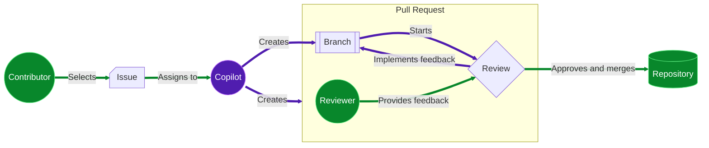

## Step 1: Enable Copilot coding agent

The Mergington Extracurricular Activities site 🎻 ⚽️ ♟️ has become a regular school tool. Although you like that attention, you just realized a problem! You are about to go on sabbatical next semester!

After some discussion with the principal, he has accepted that new features will be postponed, but... he is worried. They need to at least have _something_ for handling simple changes while you are away.

Let's set our teachers up for success by configuring Copilot to handle updates while we are away.


### Agent mode vs coding agent

If you recently completed the [Getting Started with GitHub Copilot](/skills/getting-started-with-github-copilot) exercise you learned about **chat**, **edits** and **agent** mode. These are different because they are all designed for your coding editor.

**Copilot coding agent** takes this to the next level by operating entirely on GitHub. No code editor required! 😎

| Feature             | Copilot in the editor             | Copilot coding agent           |
| ------------------- | --------------------------------- | ------------------------------ |
| **Interface**       | Inline suggestions in your editor | Issues and Pull Requests       |
| **Work Scope**      | Local files                       | Repository                     |
| **Activation**      | Inline code suggestions, chat     | Issue assignment               |
| **Developer Style** | Best for individual contributors  | Anyone if issues designed well |
| **Customization**   | Custom instructions               | Custom instructions            |
| **MCP Support**     | Yes                               | Yes                            |
| **Vibe Coding**     | 😎                                | 😎                             |

### How does it work?

From the contributor perspective, the flow is very similar to a normal workflow.

1. A contributor with **write access** selects an issue and assigns it to Copilot (instead of themself).
2. Copilot creates a branch and pull request.
3. Copilot works on the branch in an Actions workflow and provides updates via the pull request conversation tab.
4. When Copilot finishes the issue, the assigner is requested to review.
5. Assigner submits a review, adds comments, or approves.
6. If feedback is provide, Copilot continues working to implement it.
7. The requester repeats above steps until satisfied and then merges.



### Is this safe?

Several security precautions have been implemented to help reduce concerns. Here are a few limitations that you might need to consider when asking Copilot to work on an issue.

- Copilot can only make changes on the branch it created and resources provided by the repository.
- Copilot has restricted access to the internet.
- Only users with write access can assign Copilot an issue.
- Hidden content in issues (like commented code) is ignored.

> [!IMPORTANT]
> The full list of mitigations and configuration settings can be found in the [Risks & Mitigations](https://docs.github.com/en/enterprise-cloud@latest/early-access/copilot/coding-agent/using-copilot-coding-agent#copilot-coding-agent-risks-and-mitigations) documentation.

### Important considerations

- Impact on GitHub Actions minutes usage.
- Free accounts have a limited amount of Actions minutes.

  > [!TIP]
  > You might consider unwatching this repository. This exercise will produce several notifications and emails from Copilot.

### ⌨️ Activity: (optional) Quick reminder of the extracurricular activities website

1. Show how to launch the codespace.
2. Show how to view the app running.

### ⌨️ Activity: Assign your agent an issue

There are several important issues to get done before we leave, but let's do a test run on one of the simple options first. This will let us see how interactions and collaboration work, so we can update our docs for guiding the other teachers. Most don't know how to use a traditional coding editor!

> [!TIP]
> Try to make an issue's goal and acceptance criteria clear. Also, breaking down large tasks into shorter ones provides more opportunity for feedback!

1. In the top navigation, click the **Issues** tab.
1. Above the list, on the top right, click the **New Issue** button.
1. Set the **Title** to `Missing Activity: Manga Maniacs`, enter the below text, and click the **Create** button.

   ```md
   The manga club was recently announced and is naturally missing form the website. Please add it.

   Here are the details:

   Description: Explore the fantastic stories of the most interesting characters from Japanese Manga (graphic novels).

   Schedule: Tuesdays at 7pm
   Max attendance: 15 people
   ```

1. In the top right, click on the **Assignees** area and select **Copilot**.

   

1. At the bottom, click the **Create** button. On the new page, you will notice:

   - The issue will have an `👀` reaction to show Copilot is reading the issue.
   - The activity log shows you assigned the issue to Copilot.

1. After a moment, you will receive a notification that Copilot has begun work. Additionally, the issue log will show a pull request has been started.

   

1. With the issue assigned, Mona should be busy checking your work. Give her a moment to share the next steps.

<details>
   <summary>Having trouble? 🤷</summary><br/>

If you don't get feedback, here are some things to check:

- Make sure you assigned the correct issue. If you practice on other issues, they will be ignored.

</details>
