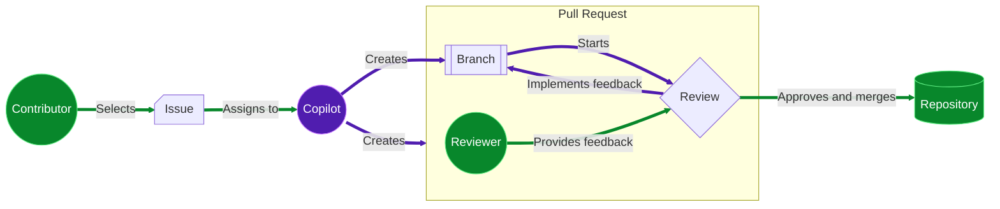

## Step 1: Enable Copilot coding agent

The Mergington Extracurricular Activities site 🎻 ⚽️ ♟️ has become a regular school tool. Although you like that attention, you just realized a problem! You are about to go on sabbatical next semester!

After some discussion with the principal, he has accepted that new features will be postponed, but... he is worried. They need to at least have _something_ for handling simple changes while you are away.

Let's set up our teachers so Copilot coding agent can handle updates while we are away.


### Agent mode vs coding agent

If you recently completed the [Getting Started with GitHub Copilot](/skills/getting-started-with-github-copilot) exercise you learned about **chat**, **edits** and **agent** mode. These are different because they are all designed for your coding editor.

**Copilot coding agent** takes this to the next level, by operating entirely on GitHub, no code editor required!

| Feature               | Copilot in the editor              | Copilot coding agent                                |
| --------------------- | ---------------------------------- | --------------------------------------------------- |
| **Interface**         | Inline suggestions in your editor  | Issues and Pull Requests                            |
| **Context Awareness** | Local files and prompting          | Broader repo-level and task context understanding   |
| **Use Cases**         | Autocomplete code, write functions | Refactor code, generate PRs, explain logic, debug   |
| **Activation**        | Enabled in IDE                     | Invoked via chat or task workflows                  |
| **Customization**     | Suggestion tuning via prompt       | Persona-based behavior (e.g., “padawan”)            |
| **Integration**       | Integrated into VS Code only       | Works across GitHub workflows, PRs, and issues      |
| **Skill Level**       | Ideal for individual developers    | Designed to assist across teams, especially juniors |
| **Licensing**         | Requires Copilot subscription      | Requires Copilot for Business / Copilot Workspace   |

### How does it work?

From the contributor perspective, the flow is very similar to a normal workflow.

1. A contributor with **write access** selects an issue and assigns it to Copilot.
2. Copilot creates a branch and pull request.
3. Copilot works on the branch while providing updates on the pull request conversation tab.
4. When Copilot finishes the issue, the assigner is requested to review.
5. Requester submits a review, adds comments, or approves.
6. If feedback is provide, Copilot continues working to implement it.
7. The requester repeats above steps until satisfied and then merges.



### Is this safe?

Several security precautions have been implemented to help reduce concerns. Here are a few limitations that you might need to consider when asking Copilot agent to work on an issue.

- Copilot can only make changes on the branch it created and resources provided by the repository.
- Copilot has restricted access to the internet.
- Only users with write access can assign Copilot an issue.
- Copilot cannot trigger GitHub Actions workflows.

> [!IMPORTANT]
> For the full list of mitigations and settings, please see the [Risks & Mitigations](https://docs.github.com/en/enterprise-cloud@latest/early-access/copilot/project-padawan/using-project-padawan#project-padawan-risks-and-mitigations) documentation.

### ⌨️ Activity: (optional) Quick reminder of the extracurricular activities website

1. Show how to launch the codespace.
2. Show how to view the app running.

### ⌨️ Activity: Install Copilot coding agent

Before we can start assigning issues to Copilot agent, we need to provide access on our account.

> [!NOTE]
> These instructions are for your personal account. Please see the documentation for [enabling Copilot agent on an organization](https://docs.github.com/en/enterprise-cloud@latest/early-access/copilot/project-padawan/using-project-padawan#enable-project-padawan-from-the-organizations-settings).

1. Navigate to the [Copilot coding agent GitHub App](https://github.com/apps/copilot-swe-agent) page.

   

1. In the top right, press the **Configure** button.

1. When asked where to install Copilot, find your personal account and click **Configure**.
   

1. At the permissions page select **Only select repositories** and select your exercise repository `{{full_repo_name}}`.

   > 💡**Tip:** You can modify this later in your account settings.

    

1. You will now be in your account settings on the configuration page for this application.

1. With out application installed, let's inform Mona that we are ready to continue.

   ```md
   Hello @professortocat, I've installed Copilot coding agent on my account. What's next?
   ```

<details>
<summary>Having trouble? 🤷</summary><br/>

If you don't get feedback, here are some things to check:

- Make sure you are using your personal account, not a work account, managed user account, or organization.

</details>

Tip: If you can reduce the number of notifications and emails from Copilot by unwatching the repository, before continuing this exercise.
