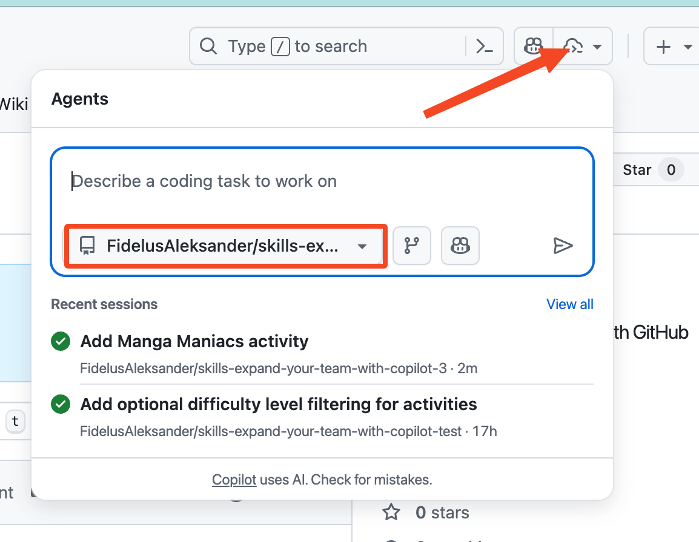
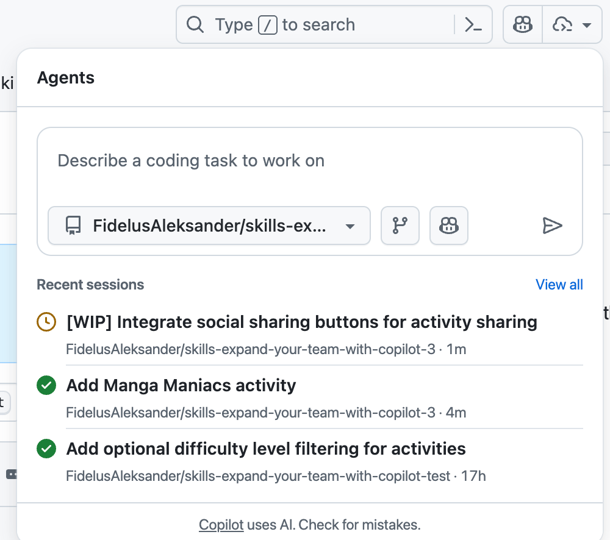
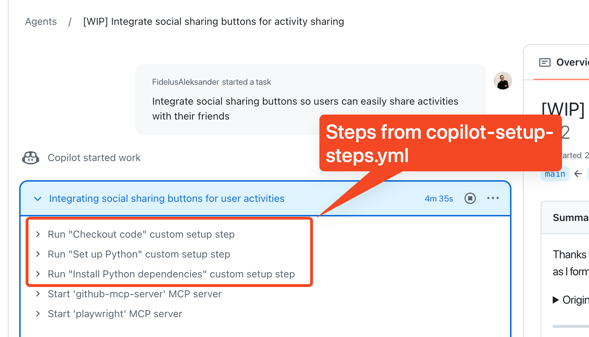
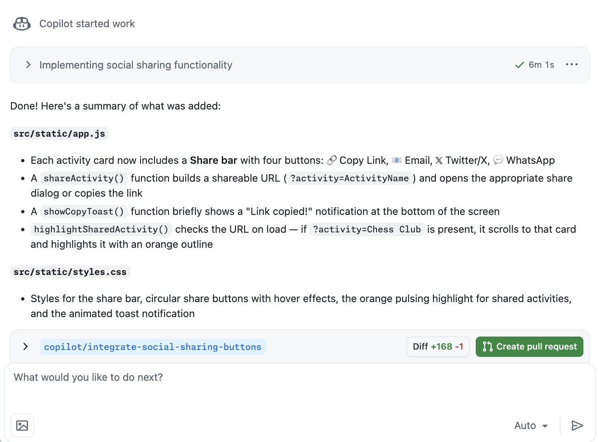
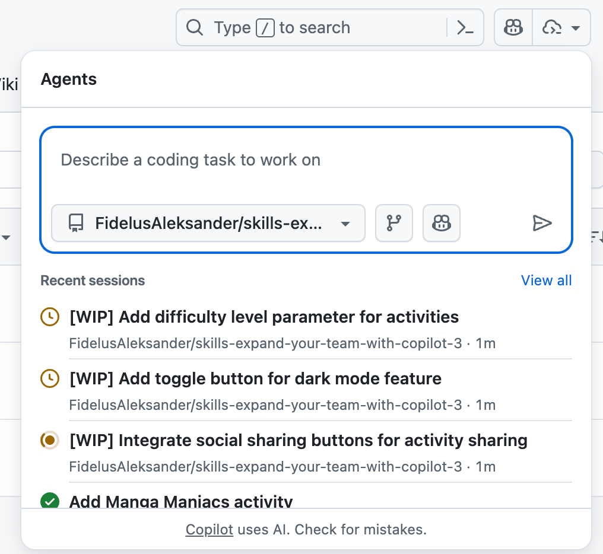

## Step 4: Manage multiple tasks with Agents Panel 🎛️

Now, with Copilot's workspace prepared, let's work on some more complex issues to make the Extra curricular Activities website even more amazing! ✨🚀

Until now, we've been teaming up with Copilot by assigning issues one at a time. 📝🤝

But what if you could skip the extra steps and jump straight into task mode? What if Copilot could juggle several jobs at once, keeping you in the loop as they progress? 🤹‍♂️

Let's see how that's done! 👀

### 📖 Theory: Delegate from anywhere with Agents Panel

The agents panel is your mission control center for agentic workflows on GitHub.

It’s a lightweight overlay that allows you to give new tasks to Copilot and track existing tasks without navigating away from your current work.

   <!-- image source: https://github.blog/news-insights/product-news/agents-panel-launch-copilot-coding-agent-tasks-anywhere-on-github/ -->

   

From the agents panel, you can:

- 🛠️ Assign background tasks without switching pages.
- 👀 Monitor running tasks with real-time status.
- 🔗 Jump into pull requests when you’re ready to review.

With the Agents panel, you can quickly assign multiple issues, track their progress, and review results—all in one place.

### ⌨️ Activity: Assign tasks through the Agents Panel :robot:

> [!IMPORTANT]
> Make sure you merged the `prepare-environment` branch from the previous step before proceeding.

Let's get you familiarized with the Agents panel!

1. In a new tab, open the **Copilot Agents** panel from the top navigation bar

   

1. Make sure the `{{ full_repo_name }}` repository is selected in the panel and the branch is set to `main`.

1. Insert the following task description and submit it. Copilot will start a branch and begin working, without creating a pull request.

   

   ```prompt
   Integrate social sharing buttons so
   users can easily share activities with their friends
   ```

   > 💡 **Tip:** Since no pull request is created, this is a great way to experiment and be creative, without adding noise to your project history. If you don't like the results, just delete the branch!

1. After a moment, you will notice that the task appears in the panel with its current status. You can check back here for a high level overview of all your assigned tasks.

   

1. Click on the task to jump straight into the session logs in a new tab and track how Copilot is working on it in real time.

1. You will notice Copilot begins by running the customization steps you've set up in the previous step!

   

1. Let's leave Copilot to work its magic for now, you can come back to review the results later and optionally create a pull request. ✨

   

> [!TIP]
> You can also access the Agents Panel in full screen mode at https://github.com/copilot/agents

### ⌨️ Activity: Try implementing 2 issues simultaneously

You still have some issues opened on the repository, let's see how Copilot can handle working on multiple issues at the same time!

1. In the top navigation, select the **Issues** tab.

1. Find the following 2 issues and open each in a new tab.
   - `Difficulty Tracks`
   - `Dark Mode`

1. With both tabs open, assign both to Copilot simultaneously.

1. Open the **Copilot Agents** panel again and notice that the issues you assign also appear here!

   

1. For both tasks, monitor the progress in separate browser tabs. Remember, since these were created from issues, you can also track them from the **Pull Requests** tab.

   > 💡 **Tip:** You can also check the status of the task you assigned in the previous activity. Maybe Copilot is done by now?

1. When Copilot is finished on any of the tasks, review the PR description, the changes made and merge the pull request!

1. With at least 1 pull request merged, Mona should be checking your work and preparing your final review.

> [!IMPORTANT]
> Working on multiple issues in parallel is an art-form. 🎨
> Make sure you keep them independent to avoid merge conflicts! 😱
